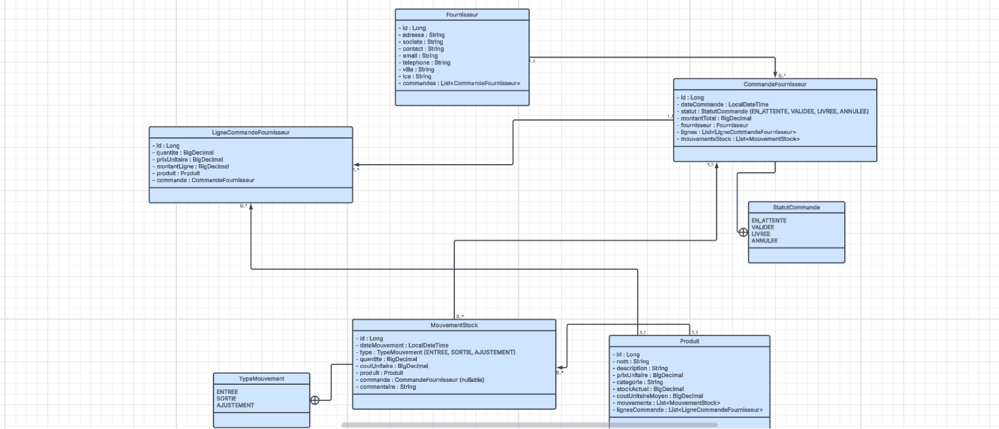

# Tricol Suppliers - API REST de Gestion des Commandes Fournisseurs

## 📋 Description

**Tricol Suppliers** est une application Spring Boot qui fournit une API REST complète pour la gestion des commandes fournisseurs, des produits et des mouvements de stock pour l'entreprise Tricol. Cette application permet de gérer efficacement les relations avec les fournisseurs, le suivi des commandes, la gestion des stocks et la valorisation des produits.

## 🎯 Fonctionnalités Principales

- **Gestion des Fournisseurs** : Création, modification, consultation et suppression des fournisseurs
- **Gestion des Produits** : Gestion complète du catalogue de produits avec suivi des stocks
- **Gestion des Commandes Fournisseurs** : Création et suivi des commandes avec leurs lignes de commande
- **Gestion des Mouvements de Stock** : Suivi des entrées et sorties de stock avec différentes méthodes de valorisation
- **Valorisation des Stocks** : Support de plusieurs méthodes de valorisation (FIFO, Coût moyen, etc.)

## 🛠️ Technologies Utilisées

- **Java** : 17
- **Spring Boot** : 3.3.4
- **Spring Data JPA** : Gestion de la persistance des données
- **MySQL** : Base de données relationnelle
- **Liquibase** : Gestion des migrations de base de données
- **MapStruct** : Mapping automatique entre entités et DTOs
- **Lombok** : Réduction du code boilerplate
- **SpringDoc OpenAPI** : Documentation interactive de l'API (Swagger UI)
- **Jakarta Bean Validation** : Validation des données d'entrée

## 📦 Prérequis

Avant de commencer, assurez-vous d'avoir installé :

- **JDK 17** ou supérieur
- **Maven 3.6+**
- **MySQL 8.0+** (ou une base de données MySQL compatible)
- **Git** (pour cloner le projet)

## 🚀 Installation et Configuration

### 1. Cloner le projet

```bash
git clone <url-du-repository>
cd tricolV2
```

### 2. Configuration de la base de données

1. Créer une base de données MySQL nommée `tricol_db` :

```sql
CREATE DATABASE tricol_db CHARACTER SET utf8mb4 COLLATE utf8mb4_unicode_ci;
```

2. Modifier le fichier `src/main/resources/application.yml` avec vos paramètres de connexion :

```yaml
spring:
  datasource:
    url: jdbc:mysql://localhost:3306/tricol_db?useSSL=false&serverTimezone=UTC
    username: votre_utilisateur
    password: votre_mot_de_passe
    driver-class-name: com.mysql.cj.jdbc.Driver
```

### 3. Compilation du projet

```bash
mvn clean install
```

Les migrations Liquibase seront exécutées automatiquement au démarrage de l'application.

## ▶️ Démarrage de l'Application

Pour démarrer l'application, exécutez :

```bash
mvn spring-boot:run
```

Ou utilisez le wrapper Maven :

```bash
./mvnw spring-boot:run
```

Sur Windows :

```bash
mvnw.cmd spring-boot:run
```

L'application sera accessible sur `http://localhost:8081`

## 📚 Documentation de l'API

Une fois l'application démarrée, la documentation interactive de l'API Swagger est accessible à :

- **Swagger UI** : http://localhost:8081/swagger-ui.html
- **OpenAPI JSON** : http://localhost:8081/v3/api-docs

La documentation Swagger permet de :
- Visualiser tous les endpoints disponibles
- Tester les API directement depuis l'interface
- Consulter les modèles de données (DTOs)

## 🏗️ Architecture du Projet

```
src/main/java/com/tricol/tricolV2/
├── config/              # Configurations (Swagger, Liquibase, Propriétés)
├── controller/          # Contrôleurs REST (API endpoints)
├── dto/                 # Data Transfer Objects
├── entity/              # Entités JPA (modèle de données)
├── exception/           # Gestion des exceptions personnalisées
├── mapper/              # Mappers MapStruct (DTO ↔ Entity)
├── repository/          # Repositories Spring Data JPA
├── service/             # Logique métier
└── util/                # Utilitaires (valorisation, etc.)
```

## 📊 Diagramme de Classes

<!-- TODO: Ajoutez votre diagramme de classes ici -->


*Diagramme représentant la structure des entités et leurs relations dans le système.*

## 🔗 Planification Jira

<!-- TODO: Ajoutez le lien vers votre planification Jira -->
🔗 [Accéder à la planification Jira](https://votre-equipe.atlassian.net/jira/software/projects/TRICOL/boarhttps://trico-1761663368871.atlassian.net/jira/software/projects/SCRUM/boards/1/backlog?selectedIssue=SCRUM-36)

*Consultez la planification détaillée, les sprints et les tâches du projet.*

## 📝 Endpoints Principaux

### Fournisseurs
- `GET /api/fournisseurs` - Liste de tous les fournisseurs
- `GET /api/fournisseurs/{id}` - Détails d'un fournisseur
- `POST /api/fournisseurs` - Créer un nouveau fournisseur
- `PUT /api/fournisseurs/{id}` - Modifier un fournisseur
- `DELETE /api/fournisseurs/{id}` - Supprimer un fournisseur

### Produits
- `GET /api/produits` - Liste de tous les produits
- `GET /api/produits/{id}` - Détails d'un produit
- `POST /api/produits` - Créer un nouveau produit
- `PUT /api/produits/{id}` - Modifier un produit
- `DELETE /api/produits/{id}` - Supprimer un produit

### Commandes Fournisseurs
- `GET /api/commandes-fournisseurs` - Liste de toutes les commandes
- `GET /api/commandes-fournisseurs/{id}` - Détails d'une commande
- `POST /api/commandes-fournisseurs` - Créer une nouvelle commande
- `PUT /api/commandes-fournisseurs/{id}` - Modifier une commande

### Mouvements de Stock
- `GET /api/mouvements-stock` - Liste de tous les mouvements
- `GET /api/mouvements-stock/{id}` - Détails d'un mouvement
- `POST /api/mouvements-stock` - Enregistrer un nouveau mouvement

## 🧪 Tests

### Stratégie de test

- **Unitaires (JUnit 5 + Mockito)**: ciblent la logique métier dans les services (`FournisseurServiceImpl`, `ProduitServiceImpl`, `CommandeFournisseurServiceImpl`, `MouvementStockServiceImpl`). Les repositories sont mockés; on ne teste pas les DAO isolément.
- **Intégration (Spring Boot Test + MockMvc + Testcontainers)**: vérifient les endpoints REST, le câblage Spring, Liquibase et les interactions réelles avec MySQL en conteneur.
- **Couverture (JaCoCo)**: un rapport est généré à chaque `mvn test` pour mesurer les lignes/branches couvertes.

### Lancer les tests

Prérequis: **Docker** en cours d'exécution (Testcontainers démarre MySQL automatiquement).

```bash
mvn clean test
```

Les tests d'intégration démarrent un MySQL 8 éphémère et appliquent les changelogs Liquibase.

### Interprétation des résultats

- **Sortie Maven**: affiche les tests passés/échoués/ignorés.
- **Rapport JaCoCo**: ouvrir `target/site/jacoco/index.html` dans un navigateur.
  - Contrôler la couverture des classes critiques (services et contrôleurs).
  - Les repositories ne sont pas évalués en isolation.

### Périmètre couvert actuellement

- Unitaires: fournisseurs (CRUD, erreurs), produits (création avec mouvement d'entrée, pagination), commandes (calcul du total, changement de statut), mouvements de stock (cas insuffisant et cas heureux).
- Intégration: produits (création + listing), fournisseurs (CRUD + recherches), commandes (création, passage à `LIVREE`, vérification des mouvements).

## 📄 Migration de Base de Données

Les migrations de base de données sont gérées par Liquibase. Les fichiers de migration se trouvent dans `src/main/resources/db/changelog/`.

L'application appliquera automatiquement toutes les migrations au démarrage.

## 🤝 Contribution

1. Créer une branche pour votre fonctionnalité (`git checkout -b feature/ma-fonctionnalite`)
2. Commiter vos changements (`git commit -am 'Ajout de ma fonctionnalité'`)
3. Pousser vers la branche (`git push origin feature/ma-fonctionnalite`)
4. Ouvrir une Pull Request


**Version** : 2.0.0  

